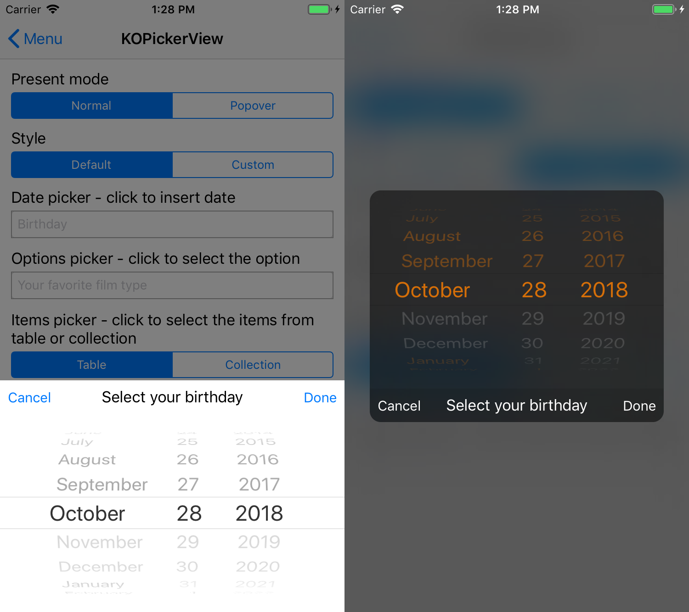

# KOControls

KOControls is a package of useful controls. It helps you to create a better user experience without a lot of effort.

Right now it contains only the few features but it will be getting the new stuff, depending on the users needs.

## Features

- [KOPresentationQueuesService](#kopresentationqueuesservice) - Service manages the queues of views to present. 
- [KOTextField](#kotextfield) - Text field supports showing and validating an error.
- [KOScrollOffsetProgressController](#koscrolloffsetprogresscontroller) - Controller that calculates progress from given range based on scroll view offset and selected calculating 'mode'. 
- [KODialogViewController](#kodialogviewcontroller) - High customizable dialog view, that can be used to create you own dialog in simply way.
- [KODatePickerViewController](#kodatepickerviewcontroller) - Simple way to get the date from the user.
- [KOOptionsPickerViewController](#kooptionspickerviewcontroller) - Simple way to get the selected option from the user.
- [KOItemsTablePickerViewController](#koitemstablepickerviewcontroller) -  Simple way to get the selected option from the user from table.
- [KOItemsCollectionPickerViewController](#koitemscollectionpickerviewcontroller) -  Simple way to get the selected option from the user from collection.
- KODimmingTransition - Transition uses presentation with dimming view.
- KOVisualEffectDimmingTransition - Transition uses presentation with dimming view with visual effect.

## Requirements

* iOS 10+
* Xcode 10.0+
* Swift 4.2+

## Installation

KOControls doesn't contains any external dependencies. If you want to stay updated install KOControls by Cocoapods.

### CocoaPods

Add below entry to the target in Podfile
```
pod 'KOControls', '~> 1.0'
```
For example

```
source 'https://github.com/CocoaPods/Specs.git'
platform :ios, '10.0'
use_frameworks!

target 'Target Name' do
pod 'KOControls', '~> 1.0'
end
```
Install the pods by running

```
pod install
```

### Manually

You can use KOControls manually and customize how you like. One of the simplest way to do that.

1. Download repository.
2. Copy the KOControls.xcodeproj and folder Sources to the your project directory.
3. In project explorer click "Add Files to 'Your project'" -> choose KOControls.xcodeproj. Xcode will add automatically KOControls as a sub-project.
4. In project settings -> Target -> Add embeded library ->  choose 'Your project' -> KOControls.xcodeproj -> Products -> KOControls.framework.
5. And thats all! If you don't want to build KOControl manually every time when you change something. Go to the scheme settings of your target to the build section and add KOControls build target.

## Usage

You need to add following import to the top of the file.

```swift
import KOControls
```

### KOPresentationQueuesService

You can add viewController to queue of presenting, to avoid a situation when there can be multiple viewControllers to present at the same time, and only one will be presented.
The simplest way to add the viewController to queue of presenting is to use the overridden function ```present``` for the presenting viewController.

```swift
let itemIdInQueue = present(viewControllerToPresent, inQueueWithIndex: messageQueueIndex)
```

The most detail one, lets you to set presenting viewController. But be careful because modalPresentationStyles that aren't presenting on current context (like custom or fullscreen) will be presented at fullscreen context outside the queue.

```swift
let itemIdInQueue = KOPresentationQueuesService.shared.presentInQueue(customDialog, onViewController: presentingContainerViewController, queueIndex: messageQueueIndex, animated: true, animationCompletion: nil)
```
To remove item from the queue, you need id of item in queue.

```swift
KOPresentationQueuesService.shared.removeFromQueue(withIndex: messageQueueIndex, itemWithId: itemIdInQueue)
```

Or index of item in queue.

```swift
KOPresentationQueuesService.shared.removeFromQueue(withIndex: messageQueueIndex, itemWithIndex: indexOfItemInQueue)
```

Another functions let you to remove multiple items from the queue.

```swift

//delete all items from queue that would be presented at 'presentingViewController'
KOPresentationQueuesService.shared.removeAllItemsFromQueue(withIndex: messageQueueIndex, forPresentingViewController: presentingViewController)

//just deletes queue with all of items
KOPresentationQueuesService.shared.deleteQueue(withIndex: messageQueueIndex)
```
The current presented item isn't in the queue, but you can check is something is presented for the queue or delete presented item if you want.

```swift
if KOPresentationQueuesService.shared.itemPresentedForQueue(withIndex: messageQueueIndex) != nil{
    //do something...
}

//dismisses current presented viewController if is
KOPresentationQueuesService.shared.removeCurrentVisibleItemForQueue(withIndex: messageQueueIndex, animated: true, animationCompletion: nil)
```
If you want to do something when queue was change (new items were add / remove, queue created / deleted), you can use ```queueChangedEvent```.

```swift
KOPresentationQueuesService.shared.queueChangedEvent = {
    queueIndex in
    //it will print count of queue items
    print(KOPresentationQueuesService.shared.itemsCountForQueue(withIndex: queueIndex) ?? 0)
}
```

### KOTextField

Text field supports showing and validating an error.

You always have to set the error description before show it. To show an error manually you need to change the default ```validateMode``` to manual and just change the flag ```isShowingError``` to true. 

```swift
errorField.errorInfoView.descriptionLabel.text = "Error description text"
errorField.validateMode = .manual
errorField.isShowingError = true
```

To don't worry about setting the flag manually, you can use auto validation feature. The default validation mode is ```validateOnLostFocus```. So in example if you want to show error when the email isn't correct you need to only add the predefinied validator.

```swift
emailField.errorInfoView.descriptionLabel.text = "Email is incorrect"
emailField.add(validator: KORegexTextValidator.mailValidator)
```
You can always adjust the border of the field to the state of: normal, error, focus; by setting ```borderSettings```.

```swift
emailField.borderSettings = KOTextFieldBorderSettings(color: UIColor.lightGray.cgColor, errorColor: UIColor.red.cgColor, focusedColor: UIColor.blue.cgColor, errorFocusedColor : UIColor.red.cgColor,  width: 1, focusedWidth: 2)
```

Field can be validated with the multiple validators based on function or regex.

```swift
passwordField.borderSettings = KOTextFieldBorderSettings(color: UIColor.lightGray.cgColor, errorColor: UIColor.red.cgColor, focusedColor: UIColor.blue.cgColor, errorFocusedColor : UIColor.red.cgColor,  width: 1, focusedWidth: 2)
passwordField.errorInfoView.descriptionLabel.text = "Password should contains 8 to 20 chars"
passwordField.validateMode = .validateOnTextChanged

//simple function based validator
passwordField.add(validator: KOFunctionTextValidator(function: {
(password) -> Bool in
    return password.count >= 8 && password.count <= 20
}))
```

Regex based validator.

```swift
passwordField.add(validator: KORegexTextValidator(regexPattern: "^(?=.*[a-z]{1,}.*)(?=.*[A-Z]{1,}.*)(?=.*[0-9]{1,}.*)(?=.*[^a-zA-Z0-9]{1,}.*).{8,20}$"))
```
Error info in default is showing in the field's superview, but you can change this by setting manually  ```showErrorInfoInView```. If you want to show error info always or manually when there is an error you can do this by change ```showErrorInfoMode```. In manually mode you show or hide error info by function  ```showErrorInfoIfCan()``` or  ```hideErrorInfoIfCan()```.

Showing error info can be customized by changing ```errorInfoView``` and its show / hide animation.

```swift
//changes animations
passwordField.errorInfoHideAnimation = KOAnimationGroup(animations:[
    KOTranslationAnimation(toValue: CGPoint(x: -200, y: 20)),
    KOFadeOutAnimation()
])
passwordField.errorInfoShowAnimation = KOAnimationGroup(animations: [
    KOTranslationAnimation(toValue: CGPoint.zero, fromValue: CGPoint(x: -200, y: 20)),
    KOFadeInAnimation(fromValue: 0)
], dampingRatio: 0.6)

//adds additional icon
passwordField.errorInfoView.imageWidthConst.constant = 25
passwordField.errorInfoView.imageView.image = UIImage(named:"ico_account")
passwordField.errorInfoView.imageViewEdgesConstraintsInsets.insets =  UIEdgeInsets(top: 8, left: 8, bottom: 8, right: 8)
passwordField.errorInfoView.imageView.contentMode = .scaleAspectFit

//other adjustments
passwordField.errorInfoView.descriptionLabel.textColor = UIColor.black
passwordField.errorInfoView.contentView.backgroundColor = UIColor.white
passwordField.errorInfoView.layer.shadowColor = UIColor.black.cgColor
passwordField.errorInfoView.layer.shadowOffset = CGSize(width: 0, height: -2)
passwordField.errorInfoView.layer.shadowRadius = 5
passwordField.errorInfoView.layer.shadowOpacity = 0.7
passwordField.errorInfoView.markerColor = UIColor.white
```

You can replace ```errorInfoView``` completely by ```customErrorInfoView```, but new view need to implement  ```KOTextFieldErrorInfoInterface```.

```swift
class UserNameErrorInfoView : UIView, KOTextFieldErrorInfoInterface{
    func markerCenterXEqualTo(_ constraint: NSLayoutXAxisAnchor) -> NSLayoutConstraint? {
        return nil
    }
}
...
//sets custom error info view
let userNameErrorInfoView = UserNameErrorInfoView()
userNameErrorInfoView.backgroundColor = UIColor.gray.withAlphaComponent(0.85)

let userNameErrorInfoLabel = UILabel()
userNameErrorInfoLabel.textColor = UIColor.white
userNameErrorInfoLabel.text = "Incorrect username try again"
userNameErrorInfoLabel.translatesAutoresizingMaskIntoConstraints = false
userNameErrorInfoView.addSubview(userNameErrorInfoLabel)
userNameErrorInfoView.addConstraints([
    userNameErrorInfoLabel.leftAnchor.constraint(equalTo: userNameErrorInfoView.leftAnchor, constant: 12),
    userNameErrorInfoLabel.rightAnchor.constraint(equalTo: userNameErrorInfoView.rightAnchor, constant: -12),
    userNameErrorInfoLabel.bottomAnchor.constraint(equalTo: userNameErrorInfoView.bottomAnchor, constant: -8),
    userNameErrorInfoLabel.topAnchor.constraint(equalTo: userNameErrorInfoView.topAnchor, constant: 8)
])

userNameField.customErrorInfoView = userNameErrorInfoView
```

Error view that is showing at the right corner of the field, can be customized by changing ```errorIconView``` or replacing it by ```customErrorView```.

```swift
//sets custom error view
let passwordErrorLabel = UILabel()
passwordErrorLabel.backgroundColor = UIColor.red
passwordErrorLabel.textColor = UIColor.black
passwordErrorLabel.textAlignment = .center
passwordErrorLabel.text = "Incorrect"

passwordField.customErrorView = passwordErrorLabel
passwordField.errorWidth = 100

//or just sets the other image
// passwordField.errorIconView.image = UIImage(named:"someImage")
```

### KOScrollOffsetProgressController

Controller that calculates progress from given range based on scroll view offset and selected calculating 'mode'. 

First declare variable.

```swift
private var scrollOffsetProgressController: KOScrollOffsetProgressController!
```

Initialize "KOScrollOffsetProgressController", and handle progress event or delegate. Controller based on scrollView and min/max offset will be calculating progress (from 0.0 to 1.0) of translation. Axis can be changed by parameter ```scrollOffsetAxis```.

```swift

scrollOffsetProgressController = KOScrollOffsetProgressController(scrollView: collectionView, minOffset: 0, maxOffset: 300)

//user have to scroll content by 300 points in y axis 
//to change topBar's height to smallest 
//and to completely show minTopBarView and hide maxTopBarView
scrollOffsetProgressController.progressChangedEvent = {
    [weak self] progress in
    guard let sSelf = self else{
        return
    }
    let entryProgress = (1.0 - progress)
    sSelf.topBarHeight.constant = entryProgress * sSelf.maxSize + progress * sSelf.minSize
    sSelf.maxTopBarView.alpha = entryProgress
    sSelf.minTopBarView.alpha = progress
    sSelf.view.layoutIfNeeded()
}
```

Depending on selected ```mode```, progress can be different:
* ```contentOffsetBased```: (default) progress is calculating from current contentOffset
* ```translationOffsetBased```: progress is calculating based on difference between last content offset and new one
* ```scrollingBlockedUntilProgressMax```: progress is calculating based on difference between touches (last and new one), scroll is completely blocked until the progress reaches value 1.0

### KODialogViewController

High customizable dialog view, that can be used to create you own dialog in simply way.

You can create your own content by inherit from ```KODialogViewController``` or from its descendants. In below example we want to create items table picker with search field. The first step will be create a class that inherit from ```KOItemsTablePickerViewController```, then we need to override function ```createContentView``` to add our searchField to the contentView.

```swift
class SearchItemsTablePickerViewController : KOItemsTablePickerViewController{
    //our search field
    private(set) weak var searchField : KOTextField!

    override func createContentView() -> UIView {
        //new contentView
        let contentView = UIView()
    
        //create default contentView for KOItemsTablePickerViewController
        let itemsTable = super.createContentView()
        contentView.addSubview(itemsTable)
        itemsTable.translatesAutoresizingMaskIntoConstraints = false
    
        let searchField = KOTextField()
        searchField.borderStyle = .roundedRect
        searchField.borderSettings = AppSettings.fieldBorder
        searchField.placeholder = "Search country"
        contentView.addSubview(searchField)
        searchField.translatesAutoresizingMaskIntoConstraints = false
        self.searchField = searchField
    
        contentView.addConstraints([
            searchField.leftAnchor.constraint(equalTo: contentView.leftAnchor, constant: 8),
            searchField.rightAnchor.constraint(equalTo: contentView.rightAnchor,  constant: -8),
            searchField.topAnchor.constraint(equalTo: contentView.topAnchor, constant: 4),
            itemsTable.topAnchor.constraint(equalTo: searchField.bottomAnchor, constant: 4),
            itemsTable.leftAnchor.constraint(equalTo: contentView.leftAnchor),
            itemsTable.rightAnchor.constraint(equalTo: contentView.rightAnchor),
            itemsTable.bottomAnchor.constraint(equalTo: contentView.bottomAnchor)
        ])
        return contentView
    }
}
```

We can additional customize our picker by changing its parameters.

```swift
dialogViewController.modalPresentationCapturesStatusBarAppearance = true
dialogViewController.backgroundVisualEffect = UIBlurEffect(style: .dark)
dialogViewController.mainViewHorizontalAlignment = .center
dialogViewController.mainViewVerticalAlignment = .center
dialogViewController.mainView.layer.cornerRadius = 12
dialogViewController.mainView.clipsToBounds = true
dialogViewController.barMode = .bottom
dialogViewController.barView.backgroundColor = UIColor.black.withAlphaComponent(0.1)
dialogViewController.barView.titleLabel.textColor = UIColor.white
(dialogViewController.barView.leftView as? UIButton)?.setTitleColor(UIColor.white, for: .normal)
(dialogViewController.barView.rightView as? UIButton)?.setTitleColor(UIColor.white, for: .normal)
```

### KODatePickerViewController

Simple way to get the date from the user.

You can use predefined function to present date picker at the screen like below. Action viewLoaded lets you to set title of barView and left / right button to accept or cancel dialog's result.

```swift
_ = presentDatePicker(viewLoadedAction: KODialogActionModel(title: "Select your birthday", action: {
    [weak self](dialogViewController) in
    let datePickerViewController = dialogViewController as! KODatePickerViewController
    //sets the cancel button
    datePickerViewController.leftBarButtonAction = KODialogActionModel.cancelAction()
    //sets the done button
    datePickerViewController.rightBarButtonAction = KODialogActionModel.doneAction(action:{
        [weak self](datePickerViewController : KODatePickerViewController) in
        //get the new date from the picker
        self?.birthdayDate = datePickerViewController.datePicker.date
    })

    //additional customization of datePicker
    datePickerViewController.datePicker.datePickerMode = .date
    datePickerViewController.datePicker.maximumDate = Date()
    datePickerViewController.datePicker.minimumDate = Calendar.current.date(byAdding: .year, value: -120, to: Date())
    datePickerViewController.datePicker.date = self?.date
    }))
```

Please go to section about [KODialogViewController](#kodialogviewcontroller) to find more about customization.

<p align="center">
  
</p>

### KOOptionsPickerViewController

Simple way to get the selected option from the user.

You can use predefined function to present option picker at the screen like below. Options is the arrays of categories / components, that user can select. Action viewLoaded lets you to set title of barView and left / right button to accept or cancel dialog's result.

```swift

fileprivate var filmTypes : [String] = [ "Action", "Adventure", "Biographical", "Comedy", "Crime", "Drama", "Family", "Horror", "Musical", "Romance", "Spy", "Thriller", "War", "Incorrect type"]

//...

_ = presentOptionsPicker(withOptions : [filmTypes], viewLoadedAction: KODialogActionModel(title: "Select your favorite film type", action: {
    [weak self](dialogViewController) in
    let optionsPickerViewController = dialogViewController as! KOOptionsPickerViewController
    //sets the cancel button
    optionsPickerViewController.leftBarButtonAction = KODialogActionModel.cancelAction()
    //sets the done button
    optionsPickerViewController.rightBarButtonAction = KODialogActionModel.doneAction(action:{
        [weak self](optionsPickerViewController : KOOptionsPickerViewController) in
        //get the selected option
        self?.favoriteFilmTypeIndex = optionsPickerViewController.optionsPicker.selectedRow(inComponent: 0)
    })
    
    //additional, sets the start value
    if let favoriteFilmTypeIndex = self?.favoriteFilmTypeIndex{
        optionsPickerViewController.optionsPicker.selectRow(favoriteFilmTypeIndex, inComponent: 0, animated: false)
    }
    }))
```

Please go to section about [KODialogViewController](#kodialogviewcontroller) to find more about customization.

### KOItemsTablePickerViewController

Simple way to get the selected option from the user from table.

You can use predefined function to present items picker at the screen like below.  Action viewLoaded lets you to set title of barView and left / right button to accept or cancel dialog's result. You need to remember to set ```contentHeight``` or ```contentWidth``` depending on alignments of main view, because UITableView can't  define how much size need. In the default situation you have to set ```contentHeight``` because ```mainViewVerticalAlignment``` is different than ```.fill```. Setting and managing items through UITableDataSource need to be handle by the user.

```swift
_ = presentItemsTablePicker(viewLoadedAction: KODialogActionModel(title: "Select your country", action: {
    [weak self](dialogViewController) in
    let itemsTablePickerViewController = dialogViewController as! KOItemsTablePickerViewController
    //sets contentHeight, because mainViewVerticalAlignment is other than .fill
    itemsTablePickerViewController.contentHeight = 300
    //sets the cancel button
    itemsTablePickerViewController.leftBarButtonAction = KODialogActionModel.cancelAction()
    //sets the done button
    itemsTablePickerViewController.rightBarButtonAction = KODialogActionModel.doneAction(action:{
        [weak self](itemsTablePickerViewController : KOItemsTablePickerViewController) in
        if let countryIndex = itemsTablePickerViewController.itemsTable.indexPathForSelectedRow?.row{
            self?.countryIndex = countryIndex
        }
    })
    itemsTablePickerViewController.itemsTable.allowsSelection = true

    //handle UITableViewDataSource
    self?.countryCollectionsController.attach(tableView: itemsTablePickerViewController.itemsTable)
    }))
```

Please go to section about [KODialogViewController](#kodialogviewcontroller) to find more about customization.

### KOItemsCollectionPickerViewController

Simple way to get the selected option from the user from collection.

You can use predefined function to present items picker at the screen like below.  Action viewLoaded lets you to set title of barView and left / right button to accept or cancel dialog's result. You need to remember to set ```contentHeight``` or ```contentWidth``` depending on alignments of main view, because UICollectionView can't  define how much size need. In the default situation you have to set ```contentHeight``` because ```mainViewVerticalAlignment``` is different than ```.fill```. Setting and managing items through UICollectionViewDataSource need to be handle by the user.

```swift
_ = presentItemsCollectionPicker(itemsCollectionLayout : UICollectionViewFlowLayout(), viewLoadedAction: KODialogActionModel(title: "Select your country", action: {
    [weak self](dialogViewController) in
    guard let sSelf = self else{
        return
    }

    let itemsCollectionPickerViewController = dialogViewController as! KOItemsCollectionPickerViewController
    //sets contentHeight, because mainViewVerticalAlignment is other than .fill
    itemsCollectionPickerViewController.contentHeight = 300
    //sets the cancel button
    itemsCollectionPickerViewController.leftBarButtonAction = KODialogActionModel.cancelAction()
    //sets the done button
    itemsCollectionPickerViewController.rightBarButtonAction = KODialogActionModel.doneAction(action:{
        [weak self](itemsCollectionPickerViewController : KOItemsCollectionPickerViewController) in
        if let countryIndex = itemsCollectionPickerViewController.itemsCollection.indexPathsForSelectedItems?.first?.row{
            self?.countryIndex = countryIndex
        }
    })
    itemsCollectionPickerViewController.itemsCollection.allowsSelection = true

    //handle UICollectionViewDataSource
    sSelf.countryCollectionsController.attach(collectionView: itemsCollectionPickerViewController.itemsCollection)
    //calculate collection size
    sSelf.countryCollectionsController.calculateCollectionSize(itemsCollectionPickerViewController.itemsCollection, availableWidth: sSelf.view.bounds.width, itemMaxWidth: 120)
    }))
```

Please go to section about [KODialogViewController](#kodialogviewcontroller) to find more about customization.

## License

This project is licensed under the MIT License - see the [LICENSE](LICENSE) file for details
